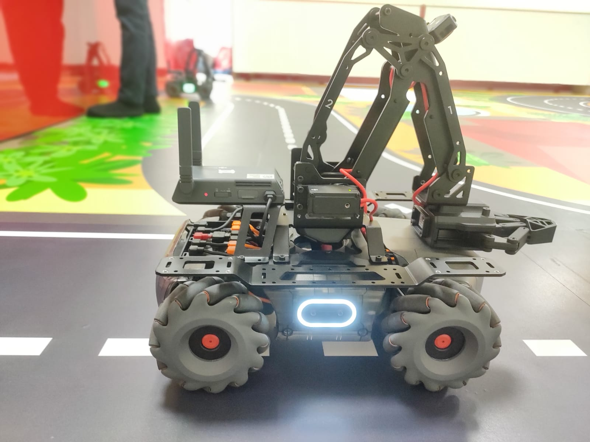
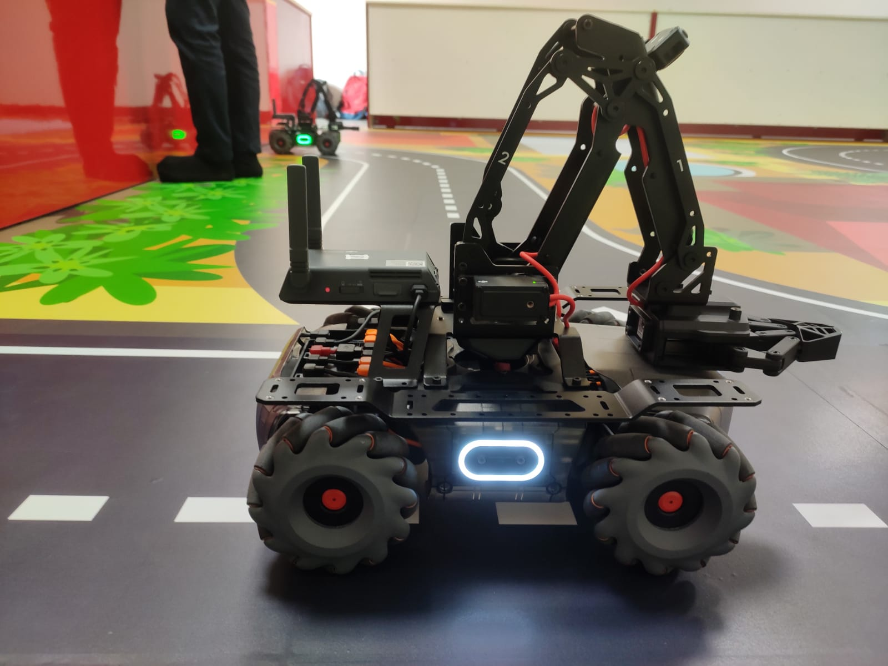

# MobileRobot-Openloopcontrol
## Aim:

To develop a python control code to move the mobilerobot along the predefined path.

## Equipments Required:
1. RoboMaster EP core
2. Python 3.7

## Procedure

### Step1:
Start the program.

## Step2:
From robo master import robot.

## Step3:
Insitilaize the type.

## Step4:
Run the program to move the robo master through our conditions.

## Step5:
End the program.

## Program
```
from robomaster import robot
import time


if _name_ == '_main_':
    ep_robot = robot.Robot()
    ep_robot.initialize(conn_type="ap")

    ep_chassis = ep_robot.chassis
    ep_led = ep_robot.led


    '''
    x = x-axis movement distance,( meters) [-5,5]
    y = y-axis movement distance,( meters) [-5,5]
    z = rotation about z axis ( degree)[-180,180]
    xy_speed = xy axis movement speed,( unit meter/second) [0.5,2]
    '''

    ep_chassis.move(x=2, y=0, z=0, xy_speed=0.8).wait_for_completed()

    ep_chassis.move(x=1, y=-0.8, z=50, xy_speed=0.8).wait_for_completed()

    ep_chassis.move(x=2.5, y=0, z=0 ,xy_speed=0.8).wait_for_completed()

    ep_chassis.move(x=0, y=0, z=60,xy_speed=0.75).wait_for_completed()

    ep_chassis.move(x=1, y=0, z=30 ,xy_speed=0.8).wait_for_completed()

    ep_chassis.move(x=1, y=0, z=30 ,xy_speed=0.9).wait_for_completed()

    ep_chassis.move(x=0.5, y=0, z=60 ,xy_speed=0.9).wait_for_completed()

    ep_chassis.move(x=0, y=0.1, z=10 ,xy_speed=0.9).wait_for_completed()

    ep_chassis.move(x=1.9, y=0, z=40 ,xy_speed=0.9).wait_for_completed()

    ep_chassis.move(x=1, y=0, z=0,xy_speed=0.9).wait_for_completed()

    ep_chassis.move(x=0, y=-0.3, z=20 ,xy_speed=0.9).wait_for_completed()

    ep_chassis.move(x=2, y=0, z=0,xy_speed=0.9).wait_for_completed()

    for i in range(10):
        ep_led.set_led(comp="all",r=100,g=00,b=0,effect="on")   
        time.sleep(1)
        ep_led.set_led(comp="all",r=200,g=200,b=200,effect="on")
        time.sleep(1)
        ep_led.set_led(comp="all",r=150,g=150,b=150,effect="on")
        time.sleep(1) 
        ep_led.set_led(comp="all",r=100,g=00,b=0,effect="on")   
        time.sleep(1)
        ep_led.set_led(comp="all",r=200,g=200,b=200,effect="on")
        time.sleep(1)
        ep_led.set_led(comp="all",r=150,g=150,b=150,effect="on")
        time.sleep(1)
        ep_led.set_led(comp="all",r=100,g=00,b=0,effect="on")   
        time.sleep(1)
        ep_led.set_led(comp="all",r=200,g=200,b=200,effect="on")
        time.sleep(1)
        ep_led.set_led(comp="all",r=150,g=150,b=150,effect="on")
        time.sleep(1)      
    
    print("Completed...")
    ep_robot.close()

    ep_robot.close()
  
    ep_robot.close(
```

## MobileRobot Movement Image:




Insert image here


<br/>
<br/>
<br/>
<br/>

## MobileRobot Movement Video:

Upload your video in Youtube and paste your video-id here

[]https://youtube.com/shorts/NFQ_LkA3QHw?feature=share
<br/>
<br/>
<br/>
<br/>

## Result:
Thus the python program code is developed to move the mobilerobot in the predefined path.


<br/>
<br/>

```
Mobile Robotics Laboratory
Department of Artificial Intelligence and Data Science/ Machine Learning
Saveetha Engineering College
```
